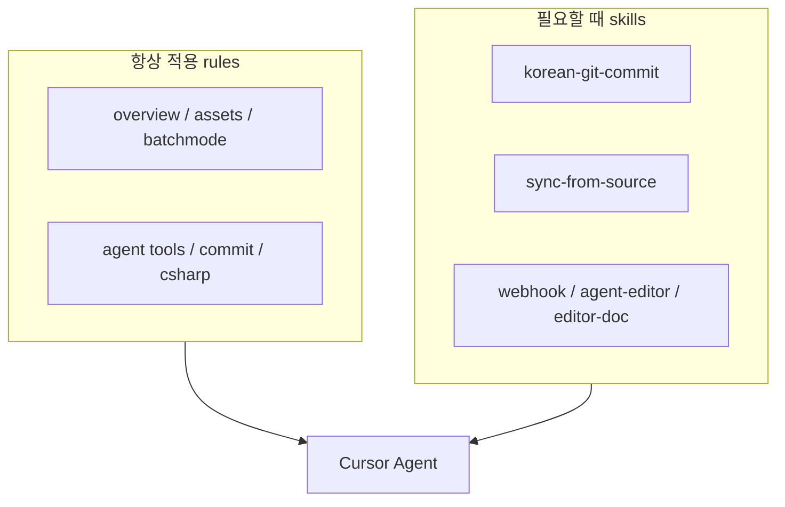

# Cursor 스킬 · 규칙

이 저장소의 `.cursor/`에는 Cursor Agent가 따르는 **프로젝트 워크플로 스킬**과 **항상 적용 규칙**이 있습니다. 공개 문서에서는 무엇을 언제 쓰는지 설명하고, 에이전트 지시문 원문은 옮기지 않습니다.


스킬 원문 경로: `.cursor/skills/project-workflows/` · 규칙: `.cursor/rules/`


## 스킬 한눈에

| 스킬 | 언제 쓰나 | 트리거 예 |
|------|-----------|-----------|
| `korean-git-commit` | 커밋 메시지 작성 | 「커밋해줘」 |
| `editor-tool-doc-writing` | 에디터 도구 사용 가이드 MD 작성 | 새 Tools 창 문서화 |
| `agent-editor-tools` | Agent 전용 Editor 도구 추가·호출 | 일회성 셋업/재생성 |
| `webhook-screenshot-feedback` | Discord/Slack으로 텍스트·스크린샷 피드백 | 「피드백 보내」 |
| `sync-from-source` | 다른 Unity 프로젝트에서 범용 자산 동기화 | `최신화` |

인덱스(라우팅만): `.cursor/skills/project-workflows/SKILL.md` — 개별 스킬로 분기합니다.

## 스킬 상세

### korean-git-commit

커밋 제목을 **`{영역} - {구체적 변경 내용}`** 형식으로 맞춥니다.

- 예: `유틸 - PlatformUtil 빌드 타입 판별 추가`
- 영역: `유틸`, `에디터`, `UI`, `문서`, `패키지`, `룰`, `스킬` 등
- 문장형 종결(`~한다`, `~합니다`) 금지 — 명사/동사구로 끝냄

항상 적용 규칙과도 묶여 있습니다: `.cursor/rules/korean-git-commit.mdc`

### editor-tool-doc-writing

Unity 에디터 도구용 **한국어 Markdown 가이드**를 `Doc/{도구이름}/` 아래에 쓸 때 따릅니다.

- 파일명: `{도구이름}Window.md` 또는 `{도구이름}.md`
- 구성: 개요 → 접근 방법 → UI → 기능 → 시나리오


공개 GitBook(`docs/site/`)과 `Doc/` 로컬 가이드는 역할이 다릅니다. GitBook은 라이브러리 학습서, `Doc/`는 개별 Tools 창 상세 매뉴얼입니다.


### agent-editor-tools

Agent가 **가끔** 돌리는 Editor 일회성 도구의 작성·호출 패턴입니다.

- `public static` 진입점
- MenuItem validate `false` → 사용자 `Tools` 메뉴 비활성
- 호출: Unity MCP `execute_code` + `TypeName.MethodName()`

사람용 플레이북: [Agent 전용 Editor 도구](../playbooks/agent-editor-tools.md)

### webhook-screenshot-feedback

Game View 스크린샷·텍스트·짧은 녹화를 **Discord / Slack 웹훅**으로 보냅니다.

- URL·활성 프로바이더는 `Secrets/`(gitignore)
- API 허브: `WebhookFeedback` — 전송 로직을 매번 새로 짜지 않음
- 메뉴 `Tools/Agent/Webhook/Send Feedback`는 Agent 전용(비활성)

개념·API 요약: [에디터 도구](editor-tools.md)의 WebhookFeedback 절

### webhook-report-media

웹훅 보고 시 **text / screenshot / recording** 중 무엇을 붙일지 판단합니다. 전송 API는 `webhook-screenshot-feedback`을 따릅니다.

### unity-recorder

Play Mode Game View를 MP4 / PNG 시퀀스로 녹화합니다 (`AgentUnityRecorder`, `Recordings/`).

### sync-from-source

설정된 **소스 Unity 프로젝트**에서 범용 유틸·룰·스킬만 이 라이브러리로 가져옵니다.

- 설정: 루트 `.env` (`SYNC_SOURCE_*`)
- 정책·파일 목록: `sync-manifest.md`
- 게임/Blender 전용은 제외, `.meta` 수동 생성 금지

사람용 플레이북: [소스 프로젝트에서 최신화](../playbooks/sync-from-source.md)

## 규칙 (항상 적용)

스킬과 별도로, 채팅마다 붙는 규칙입니다.

| 규칙 파일 | 요지 |
|-----------|------|
| `myutil-overview.mdc` | 라이브러리 범위·작업 원칙 |
| `unity-assets.mdc` | `.meta` 생성·수정 금지 |
| `unity-editor-agent-workflow.mdc` | CLI `-batchmode` 금지, MCP/Skills 사용 |
| `unity-agent-editor-tools.mdc` | Agent 전용 MenuItem 비활성 패턴 |
| `korean-git-commit.mdc` | 한국어 커밋 형식 |
| `unity-csharp-conventions.mdc` | C# 코딩·성능 컨벤션 |

## 이 저장소에 없는 것

- 전체 Unity Skills REST 모듈 트리 (별도 설치·글로벌 스킬)
- 게임 도메인·Blender 전용 스킬 (최신화 시에도 가져오지 않음)
