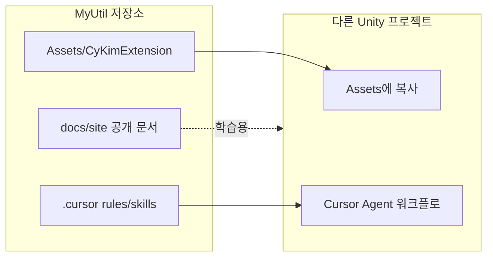

# 라이브러리 개요

MyUtil은 **게임 제품이 아니라** Unity 개인 유틸·에디터 편의 라이브러리입니다.

## 폴더 역할

| 경로 | 역할 | 공개 GitBook |
|------|------|--------------|
| `Assets/CyKimExtension/` | 런타임·에디터 C# | 개념·예제만 |
| `.cursor/rules/`, `.cursor/skills/` | Agent 규칙·스킬 | 원문 비공개 — [카탈로그](cursor-skills.md)에서 개념만 |
| `docs/site/` | 사람용 문서 (이 사이트) | Git Sync 대상 |
| `Secrets/` | 웹훅 URL 등 (gitignore) | 문서화만, 값 비공개 |
| `Recordings/` | Recorder 출력 (gitignore, Assets 밖) | 커밋하지 않음 |

## 설계 원칙 (요약)

1. **범용만** — 특정 게임 매니저·팝업·도메인 경로를 넣지 않음
2. **자주 쓰는 도구는 활성 메뉴** — `Tools/...` MenuItem 유지
3. **Agent 일회성 도구는 메뉴 비활성** — `public static` + MCP `execute_code`
4. **`.meta` 수동 생성 금지** — Unity 임포트에 맡김
5. **Editor 자동화는 열린 Editor + MCP/Skills** — CLI `-batchmode` 금지

스킬·규칙 목록: [Cursor 스킬 · 규칙](cursor-skills.md)

원문 경로(에이전트용, 복붙하지 않음): `.cursor/rules/myutil-overview.mdc`
