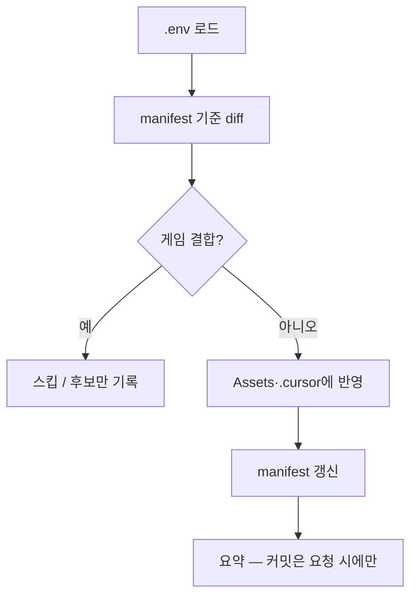

# 소스 프로젝트에서 최신화

게임 프로젝트에서 검증한 **범용** 스크립트·Cursor 규칙·스킬만 MyUtil로 가져옵니다. 게임/Blender 전용은 제외합니다.

## 준비

1. 루트 `.env`를 `.env.example`에서 복사해 채웁니다.
2. 필수 변수:

| 변수 | 의미 |
|------|------|
| `SYNC_SOURCE_ROOT` | 가져올 Unity 프로젝트 루트(절대 경로) |
| `SYNC_SOURCE_SCRIPTS_REL` | 소스 안 유틸 스크립트 상대 경로 |
| `SYNC_SOURCE_CURSOR_REL` | 소스 `.cursor` 상대 경로 (기본 `.cursor`) |
| `SYNC_SOURCE_EXTRA_DRAWER_REL` | (선택) Dictionary Drawer 추가 경로 |


`.env`는 커밋하지 마세요. 머신 경로·다른 제품명이 스킬/커밋에 하드코딩되지 않게 합니다.


## 흐름



### Cursor에서 `최신화` 입력

채팅에 `최신화`, `동기화`, `유틸 가져와` 중 하나를 입력하면 Agent가 sync 스킬을 따릅니다.



### 후보 검토

manifest에 없는 새 파일은 자동 추가하지 않고 **후보**로 보여 줍니다. 범용인지 확인한 뒤 반영합니다.



### `.meta` · 제외 정책

`.meta`는 만들지 않습니다. 전체 `unity-skills` 트리, Blender 전용, ProjectSettings 업그레이드 노이즈는 범위 밖입니다.



원문 경로(에이전트용): `.cursor/skills/project-workflows/sync-from-source/` · `sync-manifest.md`
